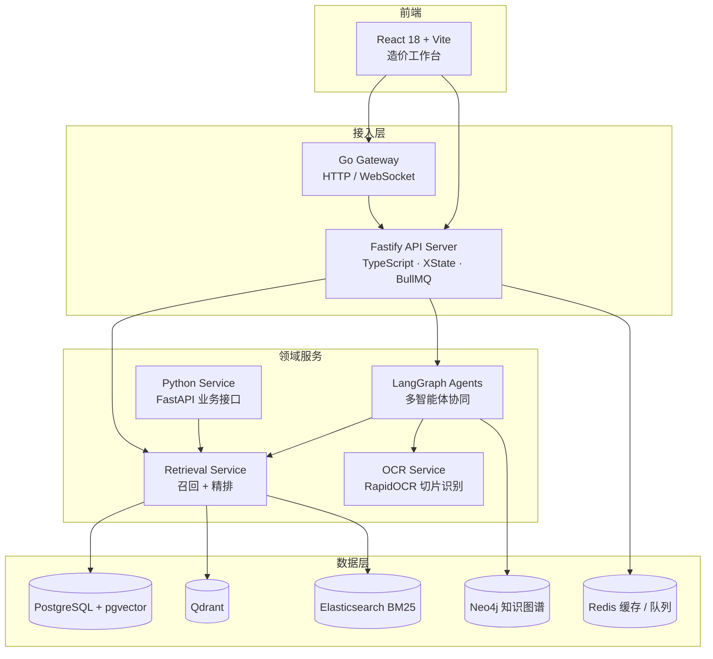

<div align="center">

<a name="top"></a>

# 🏗️ RAG26 Cost AI

**面向工程造价场景的多服务 RAG、OCR 识别与智能体协同工作台**  
*A polyglot RAG, OCR, and agent orchestration platform for construction cost intelligence*

<p>


</p>
<p>


</p>
<p>


</p>

</div>

---

## 📖 目录

- [🌟 项目简介](#-项目简介)
- [🏗 系统架构](#-系统架构)
- [⚡ 核心特性](#-核心特性)
- [🛠️ 技术栈](#️-技术栈)
- [🚀 快速开始](#-快速开始)
- [📁 项目结构](#-项目结构)
- [🧪 测试](#-测试)
- [🗺️ 路线图](#️-路线图)
- [📚 文档](#-文档)
- [📄 许可证](#-许可证)

---

## 🌟 项目简介

**RAG26 Cost AI** 是专门针对**工程造价、工程量清单核算与建材指标库**研发的混合拓扑 RAG 智能系统。针对工程行业“长表格、非标扫描件、强专业术语、跨构件依赖”等痛点，系统深度结合 OCR 结构化解析、混合检索（BM25 + 稠密向量 + 知识图谱关联）与多智能体动态协同，提供高置信度的工程造价推理与指标核算。

---

## 🏗 系统架构



---

## ⚡ 核心特性

| 特性 | 说明 |
|---|---|
| 🔀 多拓扑混合检索 | 稠密向量（pgvector / Qdrant）与 BM25（Elasticsearch）互补召回，统一精排（Rerank） |
| 🔍 工程级 OCR 解析 | 针对造价清单、工程图纸表单的网格级 OCR 重构与语义对齐，附准确率评测集 |
| 🕸️ 知识图谱关联分析 | 基于工程定额规范与主材分类构建实体关系图谱（Neo4j），识别非标主材与超额造价 |
| 🤖 多智能体协同 | LangGraph 编排的 Agent 运行时，全链路记录检索证据链与计算推导过程，抑制模型幻觉 |
| 📊 造价工作台前端 | React + Zustand 的可视化工作台，内置图表与 Mermaid 渲染 |

---

## 🛠️ 技术栈

| 层次 | 技术选型 | 说明 |
|---|---|---|
| 前端 | React 18 · TypeScript 5 · Vite · Zustand | `src/frontend/web` |
| API 服务 | Node.js 20 · Fastify 4 · XState · BullMQ | `src/backend/server` |
| 领域服务 | Python 3.10+ · FastAPI · LangGraph · RapidOCR | `src/backend/{python-legacy, ocr-service, retrieval-service, langgraph}` |
| 网关 | Go | `src/backend/go-services` |
| 数据层 | PostgreSQL 16 + pgvector · Qdrant · Neo4j 5 · Elasticsearch 8 · Redis | Schema 见 `sql/` |
| 可观测性 | OpenTelemetry · Prometheus · structlog / pino | 见 `docs/observability-guide.md` |

---

## 🚀 快速开始

### 前置要求

- Python 3.10+ 与 Node.js 20+
- 数据基础设施：PostgreSQL（启用 pgvector）、Qdrant、Neo4j、Redis；Elasticsearch 可选
- 各服务的连接参数通过环境变量配置（参考各服务目录下的配置说明）

### 1. 克隆并安装依赖

```bash
git clone https://github.com/CHINGBOH/rag26-cost-ai.git
cd rag26-cost-ai

# Python 轻量运行时（OCR / LangGraph 服务）
pip install -r requirements.txt

# 或安装完整检索项目（含开发依赖，见 pyproject.toml）
pip install -e ".[dev]"

# Node 工作区（API server + 前端 + 共享契约包）
npm install
```

### 2. 启动服务（各占用一个终端）

```bash
npm run dev:server                      # FastAPI 业务服务
npm run dev:ocr                         # OCR 识别服务（:8001）
cd src/backend/server && npm run dev    # Fastify API 服务
npm run dev:web                         # React 前端（Vite）
```

> 注：`main.py` 当前仅为占位入口；请使用上述命令分别启动各服务。

---

## 📁 项目结构

```text
rag26-cost-ai/
├── src/
│   ├── backend/
│   │   ├── server/              # Fastify API 服务（TypeScript）
│   │   ├── retrieval-service/   # 召回 + 精排检索服务
│   │   ├── ocr-service/         # OCR 识别微服务
│   │   ├── langgraph/           # LangGraph 多智能体编排
│   │   ├── go-services/         # Go 网关 / WebSocket
│   │   └── python-legacy/       # FastAPI 业务服务
│   ├── frontend/web/            # React 造价工作台
│   ├── database/                # 数据访问层
│   └── generated/               # 生成的数据契约
├── packages/shared/             # 前后端共享数据契约模型
├── ocr_tools/                   # OCR 批处理与报告生成工具集
├── ocr_web_service/             # 独立 OCR Web 服务（含演示页面）
├── sql/                         # 数据库 Schema DDL 与迁移
├── tests/                       # 单元 / 集成 / E2E / 性能测试
└── docs/                        # 架构设计与运维文档
```

---

## 🧪 测试

```bash
npm run test:node     # Fastify server 单元测试（vitest）
npm run test:python   # Python 服务测试（pytest）
pytest tests/         # 仓库级集成与回归测试（部分用例需数据基础设施在线）
```

---

## 🗺️ 路线图

- [x] 多服务混合检索链路（向量 + BM25 + 知识图谱）
- [x] 造价表格 OCR 结构化解析与准确率评测
- [x] LangGraph 多智能体编排与证据链记录
- [x] React 造价工作台前端
- [ ] 一键启动脚本与容器编排随仓库发布
- [ ] CI/CD 流水线
- [ ] Python 依赖双轨（requirements.txt / pyproject.toml）合并统一

---

## 📚 文档

| 文档 | 说明 |
|---|---|
| [快速开始详解](docs/QUICKSTART.md) | 环境搭建与服务启动完整指引 |
| [RAG 架构设计](docs/RAG_ARCHITECTURE.md) | 检索链路与多拓扑路由设计（附[架构图](docs/rag_architecture.png)） |
| [架构实现说明](docs/ARCHITECTURE_IMPLEMENTATION.md) | 分层实现与模块职责 |
| [数据管道](docs/DATA_PIPELINE.md) | 数据摄取、清洗与入库流程 |
| [工程指南](docs/ENGINEERING_GUIDE.md) | 编码规范与开发流程 |
| [部署文档](docs/DEPLOY.md) | 生产部署说明 |
| [可观测性指南](docs/observability-guide.md) | 日志、指标与链路追踪 |
| [项目资源索引](docs/project-resource-index.md) | 全仓库能力索引 |

---

## 📄 许可证

本项目基于 [MIT License](LICENSE) 开源。

---

<p align="right">(<a href="#top">回到顶部</a>)</p>
