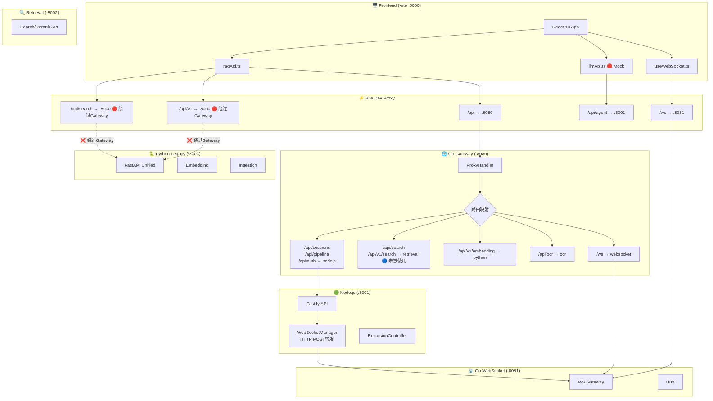

# 前后端架构衔接分析报告

> 生成时间: 2026-04-19
> 分析工具: Dependency Cruiser 17.3.10, Madge 8.0.0, Mermaid CLI 11.12.0

---

## 1. 整体架构拓扑



```mermaid
graph TB
    subgraph "Frontend (Vite :3000)"
        UI[React 18 + Vite]
        RAG_API[ragApi.ts]
        LLM_API[llmApi.ts]
        WS_HOOK[useWebSocket.ts]
    end

    subgraph "Vite Dev Proxy"
        PROXY_AGENT[/api/agent -> :3001]
        PROXY_API[/api -> :8080]
        PROXY_WS[/ws -> :8081]
    end

    subgraph "Go Gateway (:8080)"
        GW_HEALTH[/health]
        GW_METRICS[/metrics]
        GW_PROXY[ProxyHandler]
        GW_ROUTE{路由映射}
    end

    subgraph "Node.js Backend (:3001)"
        NODE_API[Fastify API]
        NODE_WS_MGR[WebSocketManager]
        NODE_CTRL[RecursionController]
        NODE_PIPE[PipelineService]
    end

    subgraph "Python Legacy (:8000)"
        PY_API[FastAPI Unified]
        PY_EMBED[Embedding]
        PY_INGEST[Ingestion]
    end

    subgraph "Retrieval Service (:8002)"
        RET_API[Standalone Search]
        RET_RERANK[Rerank]
    end

    subgraph "Go WebSocket (:8081)"
        GO_WS[WebSocket Gateway]
        GO_WS_HUB[Hub]
    end

    UI --> RAG_API
    UI --> LLM_API
    UI --> WS_HOOK

    RAG_API --> PROXY_API
    LLM_API --> PROXY_AGENT
    WS_HOOK --> PROXY_WS

    PROXY_API --> GW_PROXY
    GW_PROXY --> GW_ROUTE

    GW_ROUTE --"/api/sessions"--> NODE_API
    GW_ROUTE --"/api/pipeline"--> NODE_API
    GW_ROUTE --"/api/auth"--> NODE_API
    GW_ROUTE --"/api/agent"--> NODE_API
    GW_ROUTE --"/api/ocr"--> OCR[:8001]
    GW_ROUTE --"/api/search"--> RET_API
    GW_ROUTE --"/api/v1/search"--> RET_API
    GW_ROUTE --"/api/v1/embedding"--> PY_API
    GW_ROUTE --"/ws"--> GO_WS

    NODE_WS_MGR --"HTTP POST /broadcast"--> GO_WS
    PROXY_WS --> GO_WS
```

---

## 2. 修复结果汇总

| 优先级 | 问题 | 状态 | 修改文件 |
|--------|------|------|----------|
| P0 | 前端绕过 Gateway 直接访问 Python Legacy | ✅ 已修复 | `vite.config.ts` |
| P0 | 补充 Gateway `/api/agent` 路由 | ✅ 已修复 | `proxy.go` |
| P0 | Health 检查数据结构不匹配 | ✅ 已修复 | `ragApi.ts` |
| P1 | 前端组件循环依赖 | ✅ 已修复 | `ChatInterface.tsx`, `TaskPipelineVisual.tsx`, `DataPipelineDashboard.tsx` + 子组件 |
| P1 | 共享包开发环境路径 | ✅ 已修复 | `vite.config.ts` |
| P1 | LLM API 完全 Mock | ⏳ 待后续 | `llmApi.ts` |

---

## 3. 详细修复说明

### 3.1 统一 API 代理走 Gateway ✅

**修改前:**
```typescript
proxy: {
  '/api/search': { target: 'http://localhost:8000' },  // ❌ 绕过 Gateway
  '/api/v1':   { target: 'http://localhost:8000' },    // ❌ 绕过 Gateway
  '/api':      { target: 'http://localhost:8080' },
}
```

**修改后:**
```typescript
proxy: {
  // '/api/search' 和 '/api/v1' 已删除，统一走 '/api' -> Gateway
  '/api/agent': { target: 'http://localhost:3001' },   // 待 Gateway 支持后可移除
  '/api':       { target: 'http://localhost:8080' },   // ✅ 全部走 Gateway
}
```

**影响:** 前端 `/api/search` 和 `/api/v1/*` 现在经 Gateway 路由到 retrieval-service (`:8002`)，不再直接访问 Python Legacy。

---

### 3.2 补充 Gateway `/api/agent` 路由 ✅

**修改:** `proxy.go` `getRouteMapping()`
```go
"/api/agent": "nodejs",  // 新增
```

**影响:** 前端 `runAgent()` 调用 `/api/agent/run` 现在可通过 Gateway 正确路由到 Node.js 后端。

---

### 3.3 Health 检查数据适配 ✅

**修改:** `ragApi.ts` `checkHealth()`
- 增加对 **Python Legacy** 格式的兼容（`services.qdrant`, `services.elasticsearch` 等）
- 增加对 **Go Gateway** 格式的适配（`services.retrieval`, `services.python` 等）
- 自动检测返回格式并映射到 `vector` / `keyword` / `graph` / `cache` 维度

---

### 3.4 消除循环依赖 ✅

**当时提取的共享类型文件（现已随旧前端原型一并删除）:**
- `src/components/chat/types.ts` — `PipelineStage`, `PipelineState`
- `src/components/pipeline/types.ts` — `UploadFile`, `PipelineStats`, `DatabaseHealth`, `EvaluationMetrics`

**当时的引用关系（历史记录）:**
- `ChatInterface.tsx` / `TaskPipelineVisual.tsx` → 从 `./types` 导入
- `DataPipelineDashboard.tsx` / 5 个子组件 → 从 `./types` 导入

**验证结果:**
```bash
# 前端循环依赖检测 —— 已全部消除
$ madge --extensions ts,tsx --circular src
Processed 99 files (854ms) (6 warnings)
# (无循环依赖输出)

# 后端循环依赖检测 —— 原本就无
$ madge --extensions ts --circular src
Processed 107 files (888ms)
```

---

### 3.5 开发环境 `@rag/shared` 路径优化 ✅

**修改:** `vite.config.ts`
```typescript
function resolveSharedPath(): string {
  const distPath = path.resolve(__dirname, '../../../packages/shared/dist/index.js');
  const srcPath = path.resolve(__dirname, '../../../packages/shared/src/index.ts');
  return fs.existsSync(distPath) ? distPath : srcPath;  // dist 不存在时回退到源码
}
```

---

## 4. 未修复项

### 4.1 LLM API Mock (P1)

`llmApi.ts` 中 `sendLLMRequest` / `sendLLMStream` 仍为本地模拟。修复需要：
1. 在 Node.js 后端实现 `/api/llm/chat`（Gateway 已配置路由）
2. 或接入外部 LLM API（OpenAI / DeepSeek / Kimi）

由于涉及后端业务逻辑实现，建议单独规划和开发。

---

## 5. 服务端口对照表（修复后）

| 服务 | 端口 | Gateway 映射 | 前端 Vite Proxy |
|------|------|-------------|-----------------|
| React Frontend | 3000 | - | - |
| Node.js Backend | 3001 | `nodejs` | `/api/agent` (过渡期) |
| Python Legacy | 8000 | `python` | 已删除直接代理 ✅ |
| OCR Service | 8001 | `ocr` | - |
| Retrieval Service | 8002 | `retrieval` | 经 `/api` -> Gateway ✅ |
| LLM Service | 8003 | `llm` | - |
| Go Gateway | 8080 | self | `/api`, `/health`, `/metrics` ✅ |
| Go WebSocket | 8081 | `websocket` | `/ws` ✅ |

---

## 6. Gateway 路由映射完整表（已更新）

```go
// proxy.go - getRouteMapping()
"/api/sessions"      -> "nodejs"      (:3001)
"/api/activity"      -> "nodejs"      (:3001)
"/api/heartbeat"     -> "nodejs"      (:3001)
"/api/auth"          -> "nodejs"      (:3001)
"/api/llm/chat"      -> "nodejs"      (:3001)
"/api/cache"         -> "nodejs"      (:3001)
"/api/queue"         -> "nodejs"      (:3001)
"/api/system"        -> "nodejs"      (:3001)
"/api/pipeline"      -> "nodejs"      (:3001)
"/api/agent":        "nodejs"         (:3001)  // 新增
"/api/ocr"           -> "ocr"         (:8001)
"/api/v1/embedding"  -> "python"      (:8000)
"/api/v1/documents"  -> "python"      (:8000)
"/api/search"        -> "retrieval"   (:8002)
"/api/v1/search"     -> "retrieval"   (:8002)
"/api/v1/rerank"     -> "retrieval"   (:8002)
"/api/v1/evaluate"   -> "retrieval"   (:8002)
"/api/v1/decompose"  -> "retrieval"   (:8002)
"/api/retrieval"     -> "retrieval"   (:8002)
"/api/generate"      -> "llm"         (:8003)
"/api/chat"          -> "llm"         (:8003)
"/ws"                -> "websocket"   (:8081)
```

---

## 7. 前端 API 调用路径（修复后）

| 前端函数 | 调用路径 | Vite Proxy 目标 | Gateway 路由 | 状态 |
|----------|----------|----------------|--------------|------|
| `searchDocuments()` | `/api/search` | `:8080` Gateway | `:8002` Retrieval | ✅ |
| `searchDocumentsV1()` | `/api/v1/search` | `:8080` Gateway | `:8002` Retrieval | ✅ |
| `checkHealth()` | `/health` | `:8080` Gateway | self | ✅ |
| `checkPipelineHealth()` | `/api/pipeline/health` | `:8080` Gateway | `:3001` Node | ✅ |
| `uploadDocument()` | `/api/pipeline/upload` | `:8080` Gateway | `:3001` Node | ✅ |
| `decomposeQuery()` | `/api/v1/decompose` | `:8080` Gateway | `:8002` Retrieval | ✅ |
| `runAgent()` | `/api/agent/run` | `:3001` Node / `:8080` Gateway | `:3001` Node | ✅ Gateway 已支持 |
| `testLLMConnection()` | `/api/system/status` | `:8080` Gateway | `:3001` Node | ❓ 待确认 |

---

## 8. 后续建议

| 优先级 | 事项 | 说明 |
|--------|------|------|
| P1 | 移除 `/api/agent` 独立代理 | 待验证 Gateway `/api/agent` 稳定后，可删除 vite.config.ts 中的独立规则 |
| P1 | 实现真实 LLM API | 需后端开发 `/api/llm/chat` 或统一代理层 |
| P2 | 前端 TypeScript 严格检查 | 当前 `tsc --noEmit` 无错误（业务代码层面） |
| P2 | 后端测试类型修复 | `auth.test.ts` / `integration.test.ts` 缺少 `await`，非本次引入 |
